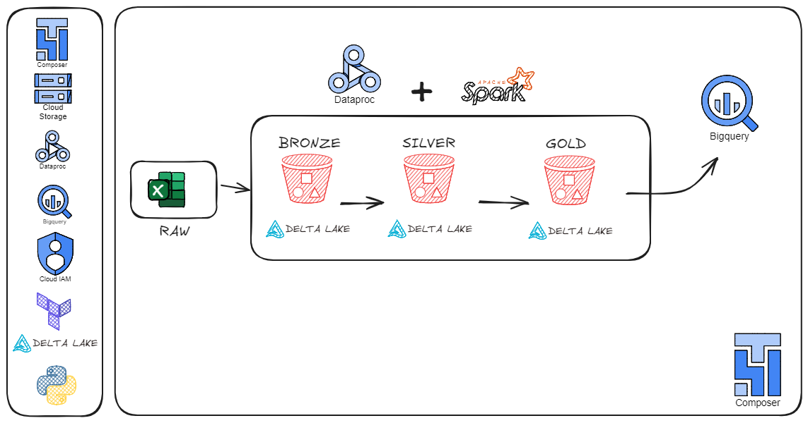
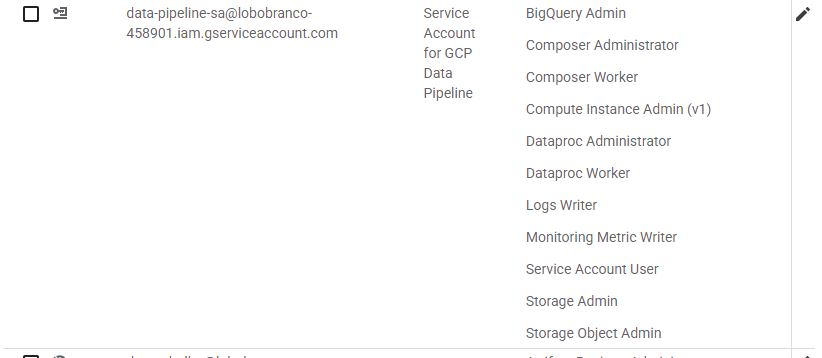

# Projeto Lakehouse com Delta Lake e Google Cloud Platform

Este projeto implementa uma arquitetura Lakehouse utilizando Apache Spark e Delta Lake, organizando os dados em camadas Bronze, Silver e Gold. O objetivo é estruturar um pipeline de dados robusto para ingestão, transformação e modelagem, garantindo qualidade e facilidade de análise.

---

## Arquitetura e Camadas



### 1. Camada Bronze (Raw + Ingestão)

- **Objetivo:** Ingestão inicial dos dados brutos (raw) recebidos de diversas fontes, armazenados em Delta Lake.
- **Características:**
  - Armazena os dados em formato Delta, mantendo a granularidade original.
  - Realiza tratamento básico, como captura de dados inválidos (badRecordsPath).
  - Particiona dados por data de ingestão para melhor performance.
- **Tecnologias:** Apache Spark, Delta Lake.

### 2. Camada Silver (Transformação e Limpeza)

- **Objetivo:** Refinamento dos dados brutos com limpeza, deduplicação, enriquecimento e aplicação de regras de negócio.
- **Características:**
  - Remove duplicatas e corrige tipos e valores inconsistentes.
  - Aplica filtros, como status válido para pedidos.
  - Realiza joins entre tabelas para criar datasets mais ricos (exemplo: detalhe de pedidos com informações do cliente e itens).
  - Particiona os dados de acordo com a lógica de negócio (exemplo: por data do pedido).
- **Tecnologias:** Apache Spark, Delta Lake.

### 3. Camada Gold (Modelagem e Consumo)

- **Objetivo:** Criar modelos analíticos otimizados para consumo por BI, dashboards e Machine Learning.
- **Características:**
  - Modelagem dimensional com tabelas fato e dimensões (ex: fato vendas, dimensões cliente, produto, tempo).
  - Permite consultas performáticas e fácil integração com ferramentas externas.
- **Tecnologias:** Apache Spark, Delta Lake.

---

## Fluxo da Pipeline

1. **Ingestão (Bronze):**  
   - Dados brutos são lidos dos arquivos CSV/Parquet originais.
   - Dados são armazenados em Delta Lake, particionados por data de ingestão.

2. **Transformação (Silver):**  
   - Dados são carregados da Bronze.
   - São aplicadas limpezas, filtros, deduplicação.
   - Dados são enriquecidos por joins entre tabelas.
   - Resultado salvo em Delta na camada Silver.

3. **Modelagem (Gold):**  
   - Dados da Silver são processados para criar tabelas fato e dimensões.
   - Dados prontos para consumo analítico.

---

## Tecnologias Utilizadas

- **Apache Spark:** processamento distribuído de dados.
- **Delta Lake:** armazenamento em formato Delta com suporte a ACID e versionamento.
- **Google Cloud Storage:** armazenamento dos dados brutos e processados.
- **Dataproc:** cluster gerenciado para execução do Spark.
- **Cloud Composer (Airflow):** orquestração das pipelines.
- **Google BigQuery** (com External Tables)
- **Terraform** (Infraestrutura como Código - IaC)

## Abordagem com Dataproc (GCP)

Este projeto utiliza o [Google Cloud Dataproc](https://cloud.google.com/dataproc) como motor de processamento distribuído com Apache Spark. A arquitetura adotada cria clusters temporários apenas durante a execução da DAG, garantindo um ambiente isolado e otimizado para cada execução.

### O que o Dataproc faz

- Executa jobs Spark em escala distribuída (ETL, transformações em camadas Bronze, Silver e Gold).
- Interage diretamente com serviços como Cloud Storage e BigQuery.
- Permite execução rápida e gerenciada de pipelines de dados sem a necessidade de manter clusters permanentemente ativos.

### Criação e destruição automatizada via Airflow

A DAG do Apache Airflow é responsável por:

1. **Criar** dinamicamente um cluster Dataproc com configurações específicas.
2. **Executar** jobs Spark com operadores como `DataprocSubmitJobOperator` ou `SparkSubmitOperator`.
3. **Deletar** automaticamente o cluster ao final da DAG, liberando recursos e evitando custos desnecessários.

> Essa abordagem garante escalabilidade sob demanda, com controle total sobre o ciclo de vida do cluster.

### Logs de execução

- O Dataproc armazena logs detalhados (stdout, stderr, Spark Driver e Executors) em um bucket específico no Google Cloud Storage.
- Estrutura típica de diretórios:
  - gs://<nome-do-bucket-dataproc-logs>/google-cloud-dataproc-metainfo/<job-id>/
- Esses logs são essenciais para **debug**, **monitoramento** e **auditoria** das execuções de pipeline.
---

```lua
├── composer
│   ├── dags
│   │   └── delta_dataproc_pipeline.py
│   ├── jars
│   │   ├── delta-core_2.12-2.3.0.jar
│   │   └── delta-storage-2.3.0.jar
│   └── scripts
│       ├── bronze.py
│       ├── gold.py
│       ├── gold_to_bigquery.py
│       └── silver.py
├── desenvolvimento_git.ipynb
├── docs
│   ├── bigquery_lakehouse.JPG
│   ├── cluster_dataproc.JPG
│   ├── composer_bucket.JPG
│   ├── composer.JPG
│   ├── iam.JPG
│   ├── lakehouse_bucket.JPG
│   ├── lakehouse_dag.JPG
│   ├── lakehousedata.JPG
│   ├── query1.JPG
│   ├── query2.JPG
│   ├── query3.JPG
│   ├── query4.JPG
│   ├── raw_data.JPG
│   └── scripts.JPG
├── infra
│   ├── credencial
│   │   └── lobobranco-458901-1258177c3d6e.json
│   ├── LICENSE.txt
│   ├── main.tf
│   ├── modules
│   │   ├── composer
│   │   ├── gcs
│   │   └── iam
│   ├── provider.tf
│   ├── terraform_1.11.4_linux_amd64.zip
│   ├── terraform.tfstate
│   ├── terraform.tfstate.backup
│   ├── terraform.tfvars
│   └── variables.tf
├── raw_data
│   ├── 2025-06-09
│   │   ├── customers.csv
│   │   ├── inventory_updates.csv
│   │   ├── order_items.csv
│   │   ├── orders.csv
│   │   └── products.csv
│   └── 2025-06-11
│       ├── customers.csv
│       ├── inventory_updates.csv
│       ├── order_items.csv
│       ├── orders.csv
│       └── products.csv
└── README.MD
```

## Como Executar

Os scripts são parametrizados para execução via linha de comando, aceitando argumentos como caminho das camadas e data de ingestão. As pipelines devem ser orquestradas preferencialmente via Airflow para controle e monitoramento.

1. Provisionar infraestrutura com Terraform

```bash
cd infra
terraform init
terraform apply --auto-approve
```

Isso criará:
  - Buckets no GCS para dados e scripts
  - Ambiente Cloud Composer configurado
  - IAM com permissões apropriadas
    

2. Enviar DAG e scripts Spark

```bash
gsutil cp composer/dags/lakehouse_dag.py gs://<bucket-composer>/dags/
gsutil cp composer/scripts/*.py gs://lakehouse_lb_bucket/scripts/
```

3. Executar DAG no Cloud Composer

  - Bronze → Silver → Gold

4. Consultar dados via BigQuery

Após o pipeline:
Tabelas Delta da camada Gold estarão disponíveis em GCS
Uma tabela externa no BigQuery é criada apontando para os arquivos Delta no bucket da camada Gold
A consulta pode ser feita diretamente via SQL
---

## Estrutura dos Dados

| Camada  | Descrição                                   | Formato        | Particionamento       |
|---------|---------------------------------------------|----------------|----------------------|
| Raw     | Dados brutos originais                       | CSV           | Data de ingestão      |
| Bronze  | Dados ingeridos e tratados                   | Delta Lake    | Data de ingestão      |
| Silver  | Dados limpos e enriquecidos                  | Delta Lake    | Data do negócio (ex: order_date) |
| Gold    | Modelagem dimensional para análise           | Delta Lake    | Conforme necessidade |

---

## Contato

Para dúvidas, sugestões ou contribuições, entre em contato: [rntt2511@gmail.com]
